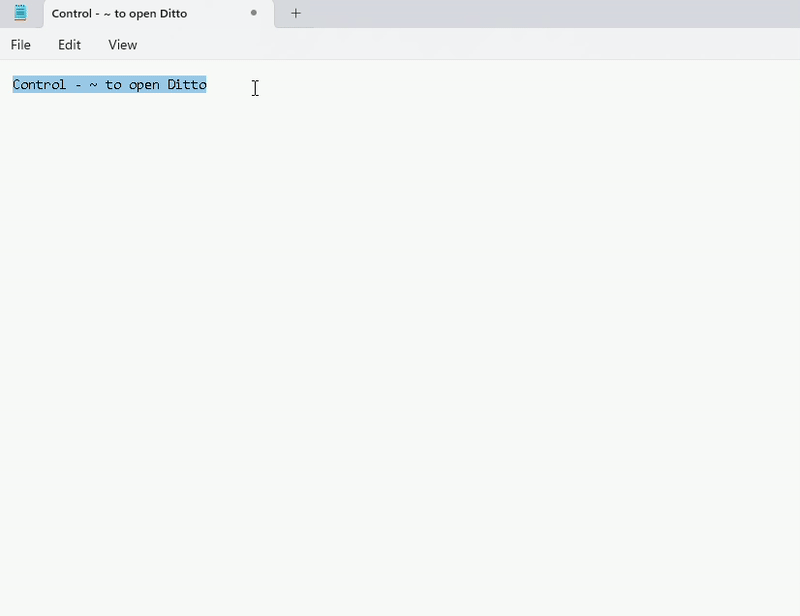

# [Ditto - 剪贴板管理器](https://github.com/sabrogden/Ditto/releases/download/3.25.113.0/DittoSetup_3_25_113_0.exe)

  

---

**[English](#ditto---clipboard-manager)** | **[中文](#ditto---剪贴板管理器)**

---

# Ditto - Clipboard Manager

---

## 基本用法

1. 运行 Ditto
2. 复制内容到剪贴板，例如在文本编辑器中选中文字后按 Ctrl+C
3. 点击系统托盘中的 Ditto 图标，或按下默认快捷键 `Ctrl + ``（反引号键）打开 Ditto
4. 双击或按回车键将选中的内容粘贴到之前的窗口

## 本地优先
- ✅ 无需登录
- ✅ 无云端依赖
- ✅ 无遥测数据

## ☁️ 云端同步与 Web 管理面板（新功能！）

Ditto 现在支持**云端同步**和基于 Web 的管理面板，实现跨设备剪贴板管理！

### 特性
- ✅ **多设备同步** - 在设备间无缝同步剪贴板内容
- ✅ **Web 管理面板** - 从任何浏览器查看、搜索和管理剪贴板
- ✅ **端到端加密** - AES-256-GCM 加密保护您的数据隐私
- ✅ **实时同步** - 基于 WebSocket 的设备间即时同步
- ✅ **自托管** - 通过 Docker 部署，完全掌控您的数据

### 快速开始云端部署

```bash
# 1. 克隆仓库
git clone https://github.com/sabrogden/Ditto.git
cd Ditto

# 2. 配置环境
cp .env.example .env
JWT_SECRET=$(openssl rand -base64 32)
sed -i "s/change-me-in-production/$JWT_SECRET/" .env

# 3. 启动后端服务
docker-compose up -d

# 4. 启动前端（开发模式）
cd web && npm install && npm run dev

# 5. 访问服务
# 前端: http://localhost:5173（Vite 默认端口）
# 后端 API: http://localhost:8080
# 健康检查: http://localhost:8080/health
```

生产环境部署（HTTPS）：
```bash
# 生成 SSL 证书
./generate-certs.sh "your-domain.com"

# 配置 JWT 密钥
echo "JWT_SECRET=$(openssl rand -base64 32)" > .env

# 启动后端（生产模式，单容器统一输出 API + 前端静态文件）
docker-compose -f docker-compose.prod.yml up -d

# 访问服务: https://localhost
```

📖 **完整文档：**
- [云端部署指南](docs/DEPLOYMENT.md)
- [云端服务器架构](docs/PROJECT_PLAN.md)
- [快速部署指南](DEPLOYMENT_GUIDE.md)
- [云端部署详解](docs/CLOUD_DEPLOYMENT.md)

### 技术栈
- **后端:** Go + SQLite3/PostgreSQL + WebSocket
- **前端:** Vue 3 + Vite + Pinia
- **加密:** AES-256-GCM 端到端加密
- **部署:** Docker Compose + Nginx (TLS)
- **监控:** Prometheus + Grafana + ELK

## 🔍 OCR 文字识别插件

Ditto 内置 OCR（光学字符识别）插件，可从剪贴板图片中提取文字。

### 特性
- ✅ **图片文字识别** - 自动检测剪贴板中的图片并提取文字
- ✅ **排版保留** - 按阅读顺序排序识别结果，自动插入换行和空格
- ✅ **纯文本粘贴** - OCR 结果写入数据表，粘贴纯文本即可获取识别内容
- ✅ **本地推理** - 基于 ONNX Runtime 1.27.1 + OpenCV 4.14.0，无需联网

### 依赖版本
- ONNX Runtime: v1.27.1（静态库构建）
- OpenCV: v4.14.0
- 模型文件通过 GitHub Releases 自动下载

📖 **构建详情：** 参见 `scripts/build-onnxruntime.bat`、`scripts/download-ocr-deps.bat`

## 📁 项目结构

```
Ditto/
├── src/                    # Ditto 主程序 (C++/MFC)
│   ├── CloudSync/          # 云端同步客户端模块
│   ├── ClipboardOCR.cpp    # OCR 集成入口
│   └── ...                 # 核心模块 (Clip, Options, QListCtrl 等)
├── Addins/
│   ├── DittoOCR/           # OCR 插件 (ONNX Runtime + OpenCV)
│   └── DittoUtil/          # 工具插件
├── server/                 # 云端后端 (Go)
│   ├── cmd/                # 入口 (server, cli)
│   ├── internal/           # handler, service, model, hub, middleware
│   ├── pkg/crypto/         # 加密库
│   └── migrations/         # 数据库迁移
├── web/                    # Web 管理面板 (Vue 3 + Vite)
│   └── src/views/          # admin, Clips, Dashboard, DashboardHome, Devices,
│                           # Groups, Login, NotFound, Settings, SyncLogs
├── docker/                 # Docker Compose 配置
├── scripts/                # 构建脚本 (ONNX, OCR 依赖, 证书生成, E2E 测试)
├── docs/                   # 文档 (部署指南、架构设计、测试报告)
└── tools/                  # 辅助工具
    ├── CloudSync_Test/     # C++ 云端同步单元测试
    ├── EncryptDecrypt/     # 加密解密工具
    ├── FocusHighlight/     # 焦点高亮工具
    ├── ICU_Loader/         # ICU 加载器
    ├── U3Stop/             # U3 停止工具
    └── focusdll/           # 焦点 DLL
```

## 🧪 测试

| 测试项目 | 语言 | 覆盖范围 |
|----------|------|----------|
| CloudSync_Test | C++ | 加密、认证、同步、CRC32、MD5、SHA2、正则、拼音转换 |
| server/tests/ | Go | 认证、剪贴板 CRUD、设备、加密、群组、统计、WebSocket、限流 |
| web/tests/ | JavaScript | E2E (认证、剪贴板、群组、同步日志、导航) |
| web/src/ | JavaScript | 单元测试 (组件、Store、API、Composables) |

运行测试：
```bash
# Go 服务端测试
cd server && go test ./...

# Web 单元测试 + E2E
cd web && npm run test:unit && npm run test:e2e
```

## Windows 代码签名策略
Windows 二进制文件的免费代码签名由 SignPath.io 提供，证书由 SignPath Foundation 提供。
<br>
<br>



---

# Ditto - 剪贴板管理器（中文版）

Ditto 是 Windows 标准剪贴板的扩展。它会保存每次放置到剪贴板上的内容，允许您随后访问这些内容。Ditto 可以保存任何可以放置到剪贴板上的信息类型，包括文本、图片、HTML、自定义格式等。

## 下载

1. [安装程序](https://github.com/sabrogden/Ditto/releases/download/3.25.113.0/DittoSetup_3_25_113_0.exe)
2. [便携版](https://github.com/sabrogden/Ditto/releases/download/3.25.113.0/DittoPortable_3_25_113_0.zip)
3. [Chocolatey](https://chocolatey.org/packages/ditto/3.23.124.0) `choco install ditto`
4. [Chocolatey 便携版](https://chocolatey.org/packages/ditto.portable/3.23.124.0) `choco install ditto.portable`
5. [Winget](https://winget.run/pkg/Ditto/Ditto) `winget install -e --id Ditto.Ditto`
6. [Windows 应用商店](https://www.microsoft.com/en-us/store/p/ditto-cp/9nblggh3zbjq)


[Help/Wiki](https://github.com/sabrogden/Ditto/wiki)&nbsp; &nbsp; &nbsp; &nbsp; &nbsp;&nbsp; &nbsp; &nbsp; &nbsp; &nbsp;[Forums](https://github.com/sabrogden/Ditto/issues)&nbsp; &nbsp; &nbsp; &nbsp; &nbsp;&nbsp; &nbsp; &nbsp; &nbsp; &nbsp;[Donate](https://www.paypal.com/donate/?item_name=Donation+to+Ditto&cmd=_donations&business=sabrogden%40gmail.com&Z3JncnB0=)&nbsp; &nbsp; &nbsp; &nbsp; &nbsp;&nbsp; &nbsp; &nbsp; &nbsp; &nbsp;[Beta](https://ditto-cp.sourceforge.io/beta/)&nbsp; &nbsp; &nbsp; &nbsp; &nbsp;&nbsp; &nbsp; &nbsp; &nbsp; &nbsp;[Source](https://github.com/sabrogden/Ditto)&nbsp; &nbsp; &nbsp; &nbsp; &nbsp;&nbsp; &nbsp; &nbsp; &nbsp; &nbsp;[History](https://github.com/sabrogden/Ditto/releases)

Ditto is an extension to the standard windows clipboard. It saves each item placed on the clipboard allowing you access to any of those items at a later time. Ditto allows you to save any type of information that can be put on the clipboard, text, images, html, custom formats.

## Download

1. [Installer](https://github.com/sabrogden/Ditto/releases/download/3.25.113.0/DittoSetup_3_25_113_0.exe)
2. [Portable](https://github.com/sabrogden/Ditto/releases/download/3.25.113.0/DittoPortable_3_25_113_0.zip)
3. [Chocolatey](https://chocolatey.org/packages/ditto/3.23.124.0) choco install ditto
4. [Chocolatey Portable](https://chocolatey.org/packages/ditto.portable/3.23.124.0) choco install ditto.portable
5. [Winget](https://winget.run/pkg/Ditto/Ditto) winget install -e --id Ditto.Ditto
6. [Windows Store App](https://www.microsoft.com/en-us/store/p/ditto-cp/9nblggh3zbjq)


## Basic Usage

1. Run Ditto
2. Copy things to the clipboard, e.g. using Ctrl-C with text selected in a text editor.
3. Open Ditto by clicking its icon in the system tray or by pressing its Hot Key which defaults to Ctrl + ` – i.e. hold down Ctrl and press the back-quote (tilde ~) key.
4. Double click or press enter on the item to paste it to the previous window.

## Local First
- No login
- No cloud
- No telemetry

## ☁️ Cloud Sync & Web Panel (New!)

Ditto now supports **cloud synchronization** and a **web-based management panel** for cross-device clipboard management!

### Features
- ✅ **Multi-device sync** - Seamlessly sync clips across devices
- ✅ **Web management panel** - View, search, and manage clips from any browser
- ✅ **End-to-end encryption** - Your data stays private with AES-256-GCM encryption
- ✅ **Real-time sync** - WebSocket-based instant sync between devices
- ✅ **Self-hosted** - Full control over your data with Docker deployment

### Quick Start Cloud Deployment

```bash
# 1. Clone the repository
git clone https://github.com/sabrogden/Ditto.git
cd Ditto

# 2. Configure environment
cp .env.example .env
JWT_SECRET=$(openssl rand -base64 32)
sed -i "s/change-me-in-production/$JWT_SECRET/" .env

# 3. Start backend service
docker-compose up -d

# 4. Start frontend (development mode)
cd web && npm install && npm run dev

# 5. Access services
# Frontend: http://localhost:5173 (Vite default port)
# Backend API: http://localhost:8080
# Health check: http://localhost:8080/health
```

For production deployment with HTTPS:
```bash
# Generate SSL certificates
./generate-certs.sh "your-domain.com"

# Configure JWT secret
echo "JWT_SECRET=$(openssl rand -base64 32)" > .env

# Start backend (production mode, single container serves API + static files)
docker-compose -f docker-compose.prod.yml up -d

# Access services: https://localhost
```

📖 **Full documentation:**
- [Cloud Deployment Guide](docs/DEPLOYMENT.md)
- [Cloud Server Architecture](docs/PROJECT_PLAN.md)
- [Quick Deployment Guide](DEPLOYMENT_GUIDE.md)

### Tech Stack
- **Backend:** Go + SQLite3/PostgreSQL + WebSocket
- **Frontend:** Vue 3 + Vite + Pinia
- **Encryption:** AES-256-GCM end-to-end encryption
- **Deployment:** Docker Compose + Nginx (TLS)
- **Monitoring:** Prometheus + Grafana + ELK

## 🔍 OCR Addin

Ditto includes an OCR (Optical Character Recognition) plugin to extract text from clipboard images.

### Features
- ✅ **Image text recognition** - Automatically detect images in clipboard and extract text
- ✅ **Layout preservation** - Sort results in reading order with automatic line breaks and spaces
- ✅ **Plain text paste** - OCR results written to data table, paste as plain text to get recognized content
- ✅ **Local inference** - Based on ONNX Runtime 1.27.1 + OpenCV 4.14.0, no internet required

### Dependencies
- ONNX Runtime: v1.27.1 (static library build)
- OpenCV: v4.14.0
- Models auto-downloaded via GitHub Releases

📖 **Build details:** See `scripts/build-onnxruntime.bat`, `scripts/download-ocr-deps.bat`

## 📁 Project Structure

```
Ditto/
├── src/                    # Ditto main app (C++/MFC)
│   ├── CloudSync/          # Cloud sync client modules
│   ├── ClipboardOCR.cpp    # OCR integration entry
│   └── ...                 # Core modules (Clip, Options, QListCtrl, etc.)
├── Addins/
│   ├── DittoOCR/           # OCR addin (ONNX Runtime + OpenCV)
│   └── DittoUtil/          # Utility addin
├── server/                 # Cloud backend (Go)
│   ├── cmd/                # Entry points (server, cli)
│   ├── internal/           # handler, service, model, hub, middleware
│   ├── pkg/crypto/         # Crypto library
│   └── migrations/         # Database migrations
├── web/                    # Web management panel (Vue 3 + Vite)
│   └── src/views/          # admin, Clips, Dashboard, DashboardHome, Devices,
│                           # Groups, Login, NotFound, Settings, SyncLogs
├── docker/                 # Docker Compose configs
├── scripts/                # Build scripts (ONNX, OCR deps, cert gen, E2E tests)
├── docs/                   # Documentation (deployment, architecture, test reports)
└── tools/                  # Auxiliary tools
    ├── CloudSync_Test/     # C++ cloud sync unit tests
    ├── EncryptDecrypt/     # Encryption/decryption tool
    ├── FocusHighlight/     # Focus highlight tool
    ├── ICU_Loader/         # ICU loader
    ├── U3Stop/             # U3 stop tool
    └── focusdll/           # Focus DLL
```

## 🧪 Testing

| Test Project | Language | Coverage |
|--------------|----------|----------|
| CloudSync_Test | C++ | Encryption, auth, sync, CRC32, MD5, SHA2, regex, pinyin conversion |
| server/tests/ | Go | Auth, clip CRUD, devices, encryption, groups, stats, WebSocket, rate limiting |
| web/tests/ | JavaScript | E2E (auth, clips, groups, sync logs, navigation) |
| web/src/ | JavaScript | Unit tests (components, stores, API, composables) |

Run tests:
```bash
# Go server tests
cd server && go test ./...

# Web unit tests + E2E
cd web && npm run test:unit && npm run test:e2e
```

## Windows Code-Signing Policy
Free code signing on Windows binaries provided by SignPath.io, certificate by SignPath Foundation.
<br>
<br>


